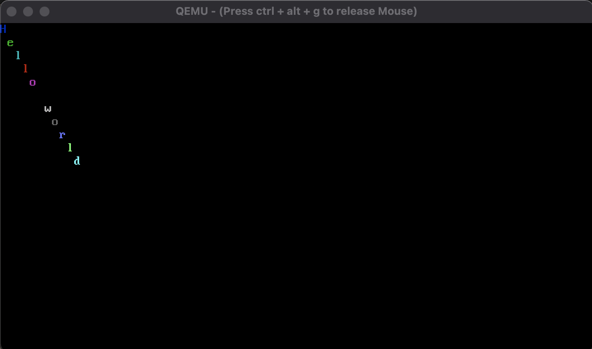

# AxOS


A toy OS in Rust made just to learn more about operating systems and for fun.

:warning: This is very much a work in progress



## Status
- [x] Up and running
- [x] Debug printing via Qemu stdout
- [x] Interrupts handled via IDT
- [x] External interrupts enabled via PIC
- [ ] Proper memory paging handling
- [ ] Kernel heap allocation

## Development
To get started run the [`setup.sh`](./setup.sh) script. To run the OS just do as you would with any other Rust program!

```sh
./setup.sh  # install required dependencies
cargo build # build the operating system
cargo run   # run the operating system
cargo check # check for warnings/errors without running
cargo test  # run all unit and integration tests
```
